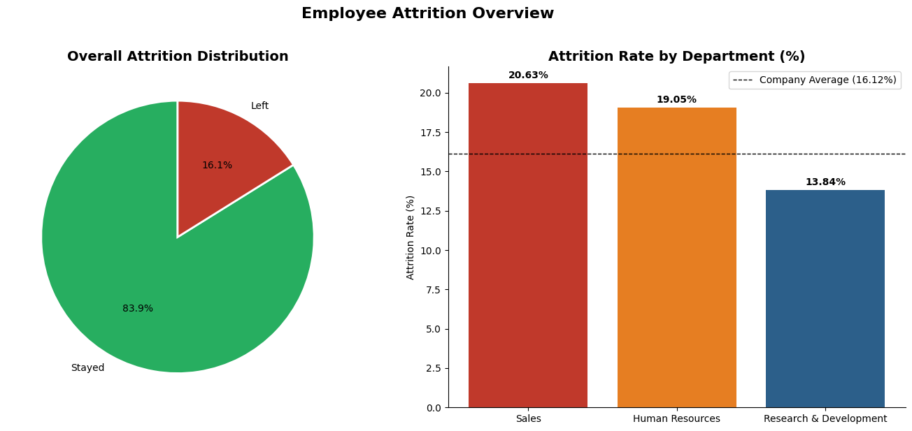
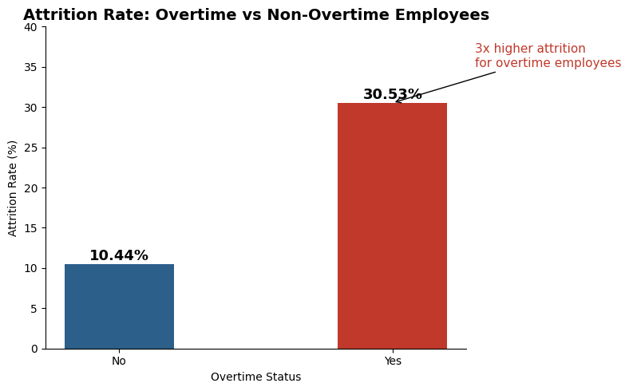
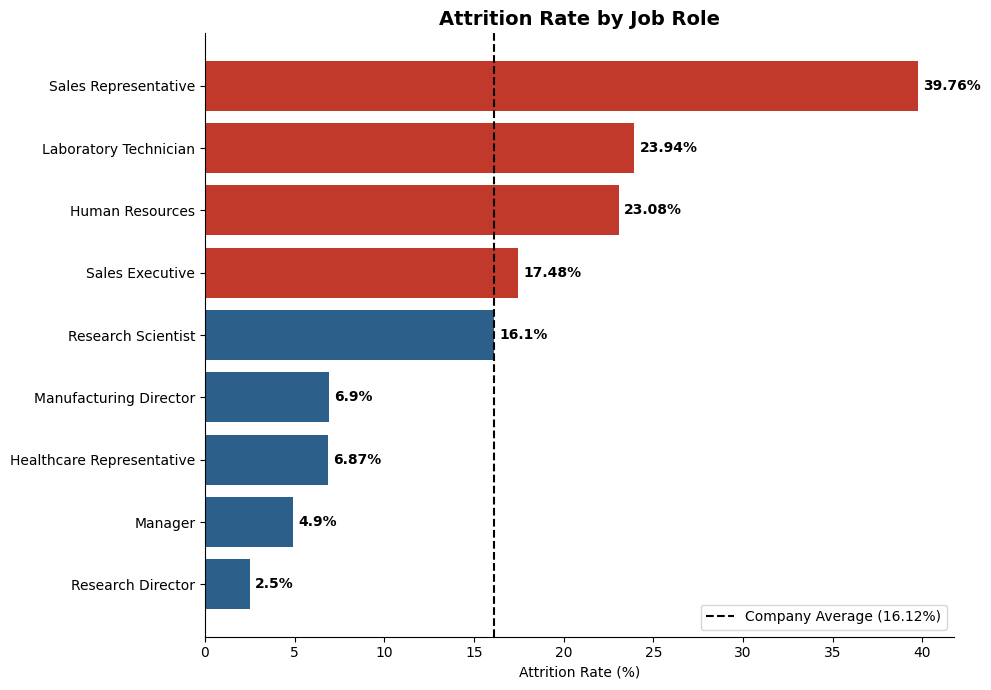
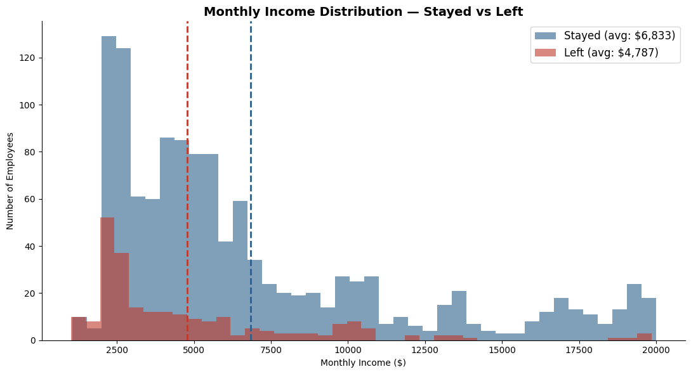
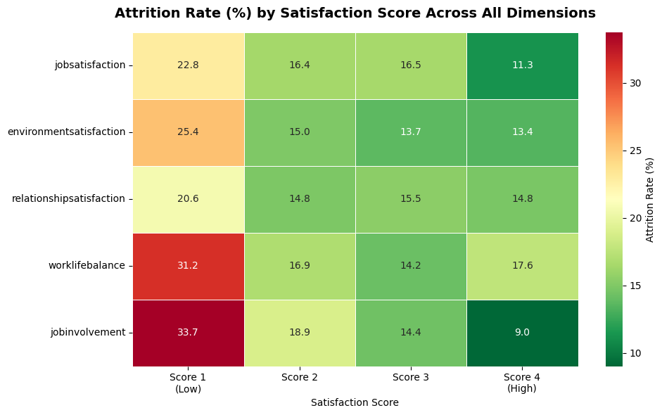

# :bar_chart: HR Analytics - Employee Attrition Analysis

> **Can we predict and prevent employee attrition using HR data alone?**
> This project uses PostgreSQL and Python to find out.

---

## :card_index_dividers: Table of Contents
- [Project Overview](#project-overview)
- [Tools & Technologies](#tools--technologies)
- [Dataset](#dataset)
- [Project Structure](#project-structure)
- [Key Findings](#key-findings)
- [Visualizations](#visualizations)
- [Business Recommendations](#business-recommendations)
- [How to Reproduce](#how-to-reproduce)
- [Author](#author)

---

## :mag_right: Project Overview

Employee attrition is one of the most expensive and preventable problems in HR management. This project conducts a full exploratory data analysis of IBM's HR dataset using **PostgreSQL** for structured querying and **Python** for visualization - moving beyond surface-level attrition rates to identify the specific, actionable drivers behind why employees leave.

The analysis is structured across six sections:
1. Data profiling and quality checks.
2. Attrition analysis by department, role, age and tenure.
3. Compensation analysis and income gap quantification.
4. Satisfaction and performance drivers.
5. Sales department deep dive - root cause analysis.
6. High-risk employee identification using multi-factor filtering.

---

| Tool | Purpose |
|------|---------|
| PostgreSQL | Database, SQL, EDA, window functions, CTEs |
| DBeaver | PostgreSQL GUI and query execution |
| Python (Pandas) | Data loading and manipulation |
| Python (Matplotlib, Seaborn) | Data visualization |
| SQLAlchemy | PostgreSQL - Python Connection|
| Jupyter Notebook | Analysis narrative and presentation |
|Git / GitHub | Version control and project hosting |

---

## :clipboard: Dataset

**IBM HR Analytics Employee Attrition & Performance**
Source: [Kaggle](https://www.kaggle.com/datasets/pavansubhasht/ibm-hr-analytics-attrition-dataset)

| Property | Value |
|----------|-------|
| Rows | 1,470 Employees |
| Columns | 35 Variables |
| Missing Values | None |
| Target Variable | Attrition (Yes/No) |

**Key Variables Used:** Age, Attrition, BusinessTravel, Department, DistanceFromHome, EnvironmentSatisfaction, Gender, JobInvolvement, JobRole, JobSatisfaction, MaritalStatus, MonthlyIncome, OverTime, PercentSalaryHike, RelationshipSatisfaction, StockOptionLevel, WorkLifeBalance, YearsAtCompany, YearsSinceLastPromotion

> **Note:** This is a synthetic dataset created by IBM for demonstration purposes. Correlations are artifically clean relative to real-world HR data, which limits direct generalizability - though the analytical methodology and business framing apply directly to real scenarios.

---

## :pushpin: Project Structure

```
hr-analytics-sql-eda/
|
├── data/
│   └── WA_Fn-UseC_-HR-Employee-Attrition.csv
|
├── sql/
│   └── hr_attrition_analysis.sql   # Full SQL analysis - setup to advanced queries
|
├── notebooks/
│   └── hr_attrition_analysis.ipynb # Python EDA  and visualizations
|
├── visualizations/
│   ├── 01_attrition_overview.png
│   ├── 02_overtime_attrition.png
│   ├── 03_attrition_by_job_role.png
│   ├── 04_income_distribution.png
│   └── 05_satisfaction_heatmap.png
|
├── README.md
```

---

## :closed_book: Key Findings

### 1. :red_circle: Overall Attrition is Above Industry Average
**16.12%** of employees have left the company - above the typical healthy benchmark of **10-12%**. This indicates a systemic retention problem rather than isolated individual turnover.

---

### 2. :red_circle: Overtime is the Strongest Single Predictor of Attrition

| Overtime Status | Attrition Rate |
|-----------------|----------------|
| Yes             | 30.53% |
| No              | 10.44% |

Overtime employees are **nearly 3x more likely to leave**. With 28.3% of the entire workforce on overtime, this represents the single highest-leverage intervention point available to leadership.

---

### 3. :red_circle: A Significant Compensation Gap Exists Between Attriters and Retainers

| Group | Average Monthly Income |
|-------|------------------------|
| Attriters | $4,787 |
| Retainers | $6,832 |
| **Gap** | **$2,045/month** |

This is not a marginal difference. Employees who left earned 30% less on average than those who stayed - compensation is a meaningful and measureable factor in retention decisions.

---

### 4. :red_circle: Attrition is Multidimentional - Not One Cause

Five satisfaction dimensions independently correlate with attrition:

| Dimension | Score 1 (Low) Attrition | Score 4 (High) Attrition |
|-----------|-------------------------|--------------------------|
| Job Satisfaction | 22.84% | 11.33% |
| Environment Satisfaction | 25.35% | 13.37% |
| Work Life Balance | 31.25% | 17.65% |
| Relationship Satisfaction | 20.65% | 14.81% |
| Job Involvement | 33.73% | 9.03% |

Employees rarely leave for just one reason. They leave when dissatisfaction accumulates across multiple dimensions simultaneoulsy. The pattern is consistent across all five metrics - lower satisfaction always means higher attrition.

---

### 5. :red_circle: Sales Department Root Cause Identified

Despite above-average compensation at the departmental level, Sales has been the highest attrition rate at **20.63%**. Deep dive analysis identified exactly where the problem lives:

| Job Role | Attrition Rate | Average Monthly Income |
|----------|----------------|------------------------|
| Sales Representative | **39.76%** | $2,626 |
| Sales Executive | 17.48% | $6,924.28 |
| Manager | 5.41% | $16.986.97 |

**The three converging factors driving Sales attrition:**
- Sales Representatives earn **62.07% less** than Sales Executives within the same department.
- **34.95%** of Sales employees leave within their first 2 years - before the company recoups onboarding costs.
- Frequent travelers leave at **33.33%** vs **8.51%** for non-travelers - and sales has disproportionately high travel frequency.

The sales attrition problem is an **entry-level compensation and travel demand problem**, not a department-wide satisfaction problem.

---

### 6. :red_circle: High-Risk Employees can be Identified Proactively

Using multi-factor SQL filtering (overtime + low satisfaction + low income + early tenure), a cohort of **current employees** was identified who share every measurable characteristic of those who have already left. This list represents preventable attrition - employees who have not left yet but are statistically likely to.

---

## :chart_with_upwards_trend: Visualizations

### Attrition Overview


### Overtime vs Attrition


### Attrition by Job Role


### Monthly Income Distribution


### Satisfaction Metrics Heatmap


---

## :bulb: Business Recommendations

### Recommendation 1 - Implement an Overtime Policy *(Priority: Critical)*
Cap mandatory overtime or introduce meaningful financial compensation for overtime hours. The nearly 3x attrition differential between overtime and non-overtime employees is the single most addressable risk identified in this analysis. Priority departments: R&D and Sales.

### Recommendation 2 - Review Sales Representative Compensation *(Priority: Critical)*
At $2,626/month average, Sales Representatives are severly underpaid relative to their travel demands and performance pressures. A structured compensation review targeting this role, combined with a clearer progression pathway from Representative to Executive, would directly address the 39.76% attrition rate.

### Recommendation 3 - Early Tenure Retention Program *(Priority: High)*
34.95% of Sales employees leave within their first 2 years - before the companu recoups hiring and onboarding investment. A structured program with 30/60/90-day check-ins, peer mentorship and milestone-based progression would reduce early turnover significantly.

### Recommendation 4 - Quaterly Satisfaction Pule Survey *(Priority: High)*
Five satisfaction dimensions independently predict attrition, yet HR has no current mechanism to monitor them proactively. A quaterly pulse survey tracking job, environment, relationship and work-life satisfaction gives leadership early warning signs **before** attrition occurs rather than after.

### Recommendation 5 - Proactive High-Risk Cohort Review *(Priority: Medium)*
SQL analysis identified a segment of current employees sharing every characteristic of those who have already left. HR reviewing this cohort quaterly - with targeted retention conversations, compensation adjustments or role changes - converts a reactive process into a proactive one.

---

## :computer: How to Reproduce

### Prerequisites
- PostgreSQL 14+ installed and running
- DBeaver or pgAdmin installed
- Python 3.8+ with the following packages:

```bash
pip install pandas numpy matplotlib seaborn sqlalchemy psycopg2-binary jupyterlab
```

### Steps

**1. Clone the repository:**
```bash
git clone 
cd hr-analytics-sql-eda
```

**2. Set up the database:**
- Open DBeaver and connect to your local PostgreSQL instance.
- Create a new database called 'hr_analytics'.
- Open 'sql/hr_attrition_analysis.sql' in DBeaver.
- Run the full script top to bottom (Ctrl + A, then Ctrl + Enter).
- This creates the table and you can import the CSV via Dbeaver's Import Data funtion.

**3. Verify the import:**
```sql
SELECT COUNT(*) FROM employees;  -- Should return 1,470
```

**4. Run the Python notebook:**
```bash
jupyter notebook notebooks/hr_attrition_analysis.ipynb
```
- Update the database connection string in the second code cell with your PostgreSQL credentials.
- Run all cells top to bottom (Cell -> Run All).

---

## :bust_in_silhouette: Author

**Shailendra Gadakari**
B.E. Computer Science - BITS Pilani
IBM Data Science Professional Certificate
Microsoft Power BI Data Analyst Professional Certificate

:email: shailendragdk2701@gmail.com
:link: [LinkedIn](https://www.linkedin.com/in/shailendra-gadakari-b0a465332/)
:octopus: [GitHub](https://github.com/shailendragadakari)
:round_pushpin: Doha, Qatar
